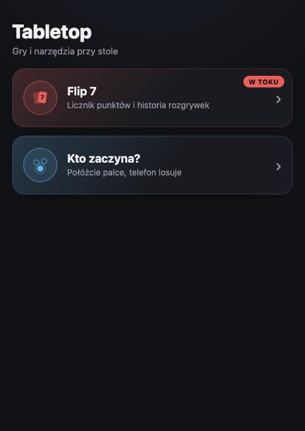
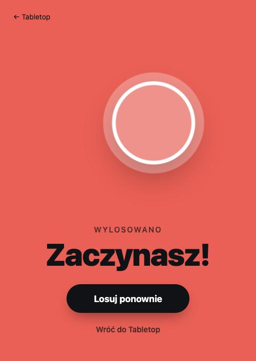

# Tabletop

Score counters and table tools for card games, built for phones. Open it, add it to the home
screen, play offline. Everything stays in the browser: no accounts, no backend, no tracking.

**Live:** https://kl0sin.github.io/tabletop/

<p>
  
  
  
  
</p>

## Apps

| App                                  | What it does                                                                                                                        |
| ------------------------------------ | ----------------------------------------------------------------------------------------------------------------------------------- |
| [**Flip 7**](flip7/README.md)        | Round-by-round score counter: type the score or tap the cards, busts and the +15 bonus are computed, dealer tracked, undo, history. |
| [**Kto zaczyna?**](picker/README.md) | "Who starts?" picker: everyone puts a finger on the screen, holds still, one gets picked.                                           |

Each app has its own README with screenshots, rules and data layout. The dashboard lists the
apps and marks the one with an unfinished game.

## How it's built

- **Static, mobile-first, offline.** Vite multi-page app deployed to GitHub Pages as a PWA.
  Vanilla TypeScript, no framework, no runtime dependencies.
- **Apps are independent.** Each lives in its own folder with its own styles and shares only a
  tiny localStorage wrapper and the registry the dashboard reads. Adding an app never touches
  the others.
- **Logic is pure and tested.** Scoring, game state, randomness and persistence are DOM-free
  modules covered by Vitest. Views are plain render functions.

Stack: Vite 8 · TypeScript (strict) · Vitest · vite-plugin-pwa · GitHub Actions → GitHub Pages

## Development

Requires Node 22 or newer.

```bash
npm install
npm run dev      # dev server exposed on your LAN, open the printed URL on a phone
npm test         # unit tests
npm run build    # typecheck + production build into dist/
npm run preview  # serve the production build locally
```

Every push to `main` runs the tests, builds and deploys.

## Adding an app

1. Create `<id>/index.html` and `src/<id>/` with its own `main.ts` and `style.css`.
2. Register the page in `vite.config.ts` under `build.rolldownOptions.input`.
3. Add it to `src/shared/games.ts` (name, description, accent colour) and an icon in
   `src/dashboard/icons.ts`.

Conventions live in [CLAUDE.md](CLAUDE.md); the design spec and implementation plan are in
[`docs/superpowers/`](docs/superpowers/).

## Roadmap

- More card games as separate apps.
- Order mode for the picker (assign 1..N instead of picking one).
- Export and import of history as JSON.
