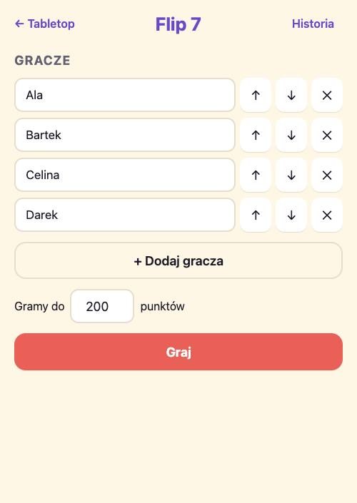
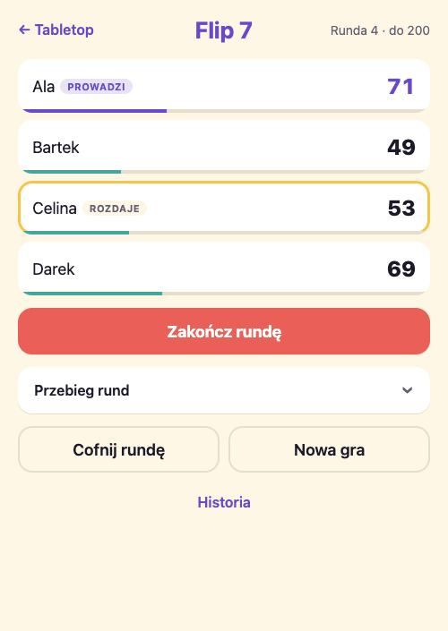
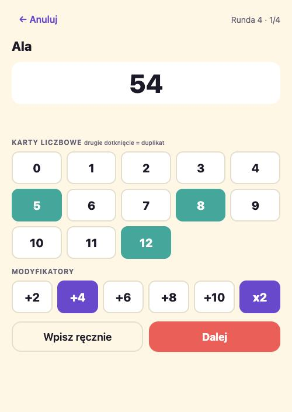
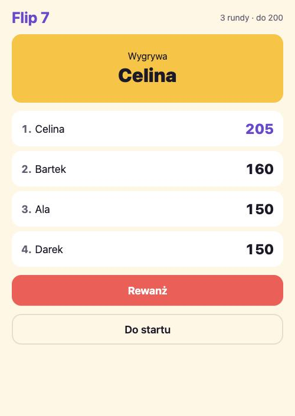

# Flip 7 – licznik punktów

Licznik do gry karcianej [Flip 7](https://boardgamegeek.com/boardgame/420087/flip-7): wpisujesz
wyniki kolejnych rund, aplikacja sumuje, pilnuje dealera i kończy grę, gdy ktoś osiągnie próg.

**Otwórz:** https://kl0sin.github.io/tabletop/flip7/

<p>
  
  
  
  
</p>

## Jak grać z aplikacją

1. **Start.** Wpisz graczy w kolejności siedzenia przy stole (ważne dla rotacji dealera) i próg
   punktów, domyślnie 200. Imiona z ostatniej gry są podpowiadane.
2. **Tabela.** Widać sumy, kto prowadzi i kto rozdaje. „Przebieg rund” rozwija tabelę wynik po
   wyniku. „Cofnij rundę” naprawia pomyłkę.
3. **Zakończ rundę.** Aplikacja przechodzi przez graczy po kolei. Wynik wpisujesz klawiaturą
   (przycisk **Bust** ustawia 0) albo przełączasz na **Policz z kart** i dotykasz karty, które
   gracz zebrał. Wynik liczy się na żywo, razem z bonusem za siedem kart i bustem.
4. **Koniec.** Gdy po zamknięciu rundy ktoś ma co najmniej tyle punktów, ile wynosi próg, i jest
   samodzielnym liderem, gra się kończy. Remis na szczycie oznacza kolejną rundę. „Rewanż”
   zaczyna nową grę tym samym składem.
5. **Historia.** Zakończone gry z datą, zwycięzcą i wynikami. Przechowywanych jest 100 ostatnich.

## Zasady, które aplikacja liczy

| Sytuacja                              | Wynik rundy                             |
| ------------------------------------- | --------------------------------------- |
| Karty liczbowe 0–12                   | suma wartości                           |
| Modyfikator ×2                        | podwaja sumę kart liczbowych            |
| Modyfikatory +2, +4, +6, +8, +10      | dodawane po podwojeniu                  |
| Siedem różnych kart liczbowych        | +15 (Flip 7)                            |
| Dwie takie same karty liczbowe (bust) | 0 punktów, niezależnie od modyfikatorów |

Karty akcji (Freeze, Flip Three, Second Chance) nie wpływają na punkty, więc aplikacja ich nie
modeluje. W trybie kart drugie dotknięcie tej samej liczby oznacza duplikat, trzecie ją czyści.

## Dane

Wszystko jest w `localStorage` przeglądarki, bez konta i bez serwera:

| Klucz               | Zawartość                                       |
| ------------------- | ----------------------------------------------- |
| `flip7:current`     | gra w toku (po odświeżeniu wraca do tabeli)     |
| `flip7:history`     | zakończone gry, najnowsze pierwsze, limit 100   |
| `flip7:lastPlayers` | imiona z ostatniej gry, podpowiadane na starcie |

Każdy zapis ma pole `version`, żeby dało się zmigrować format bez utraty historii.

## Kod

```
flip7/index.html          wejście strony
src/flip7/
  scoring.ts              czysta punktacja rundy (testy: scoring.test.ts)
  game.ts                 stan gry: rundy, dealer, zwycięzca, undo (testy: game.test.ts)
  storage.ts              klucze flip7:* (testy: storage.test.ts)
  main.ts                 przełącznik ekranów i zapis
  views/                  start, table, round, end, history + helpery dom.ts
  style.css               własny motyw, niezależny od reszty Tabletop
```

Logika jest wolna od DOM i pokryta testami Vitest. Widoki to proste funkcje renderujące.
