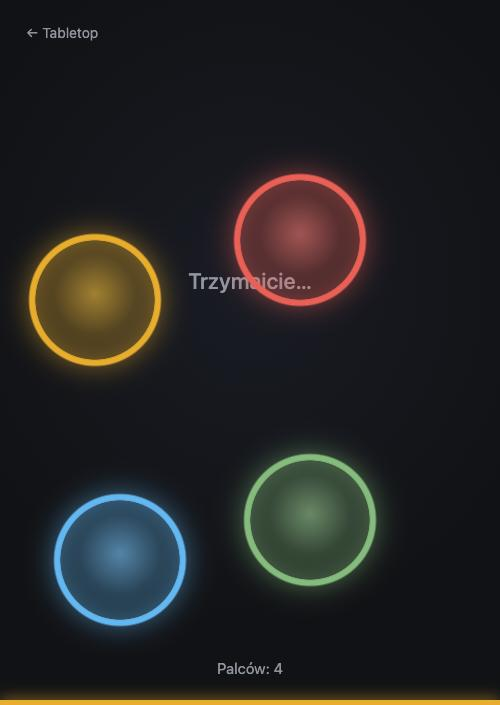

# Kto zaczyna? – losowanie palcem

Wszyscy kładą palec na ekranie telefonu, trzymają chwilę nieruchomo, a aplikacja wybiera jeden
z nich. Zero ustawień, zero zapisywania.

**Otwórz:** https://kl0sin.github.io/tabletop/picker/

<p>
  
  
</p>

## Jak to działa

1. Każdy palec dostaje kolorowy krąg, który za nim podąża. Na dole widać licznik palców.
2. Gdy na ekranie są co najmniej dwa palce i przez dwie sekundy nikt nie dokłada ani nie zabiera
   palca, rusza odliczanie: kręgi pulsują i wysyłają fale, a pasek u dołu się wypełnia. Zmiana
   składu palców w trakcie zaczyna odliczanie od nowa.
3. Kręgi gasną jeden po drugim, coraz szybciej. Ostatni zostaje, a jego kolor zalewa cały ekran.
4. Ekran wyniku pokazuje „Zaczynasz!” z przyciskiem **Losuj ponownie**. Palce można zdjąć, wynik
   zostaje do czasu naciśnięcia przycisku.

Losowanie używa `crypto.getRandomValues`, więc jest równie uczciwe jak rzut kością.

## Ograniczenia

Liczba jednocześnie śledzonych palców zależy od sprzętu: iPhone około 5, iPad około 11, telefony
z Androidem zwykle 10. Przy większej ekipie losujcie w dwóch turach. Licznik na ekranie pokazuje,
czy wszyscy zostali policzeni.

Wibracja przy losowaniu działa na Androidzie. Safari na iOS nie udostępnia wibracji stronom.

## Kod

```
picker/index.html         wejście strony
src/picker/
  main.ts                 maszyna stanów: idle → armed → picking → result
  random.ts               randomIndex i shuffle bez obciążenia modulo (testy: random.test.ts)
  style.css               kręgi, fale, zalanie kolorem, ekran wyniku
```

Strona blokuje gesty przeglądarki (przewijanie, odświeżanie gestem, zoom, menu długiego
przytrzymania), żeby palce na ekranie nie wywoływały niczego poza losowaniem.
